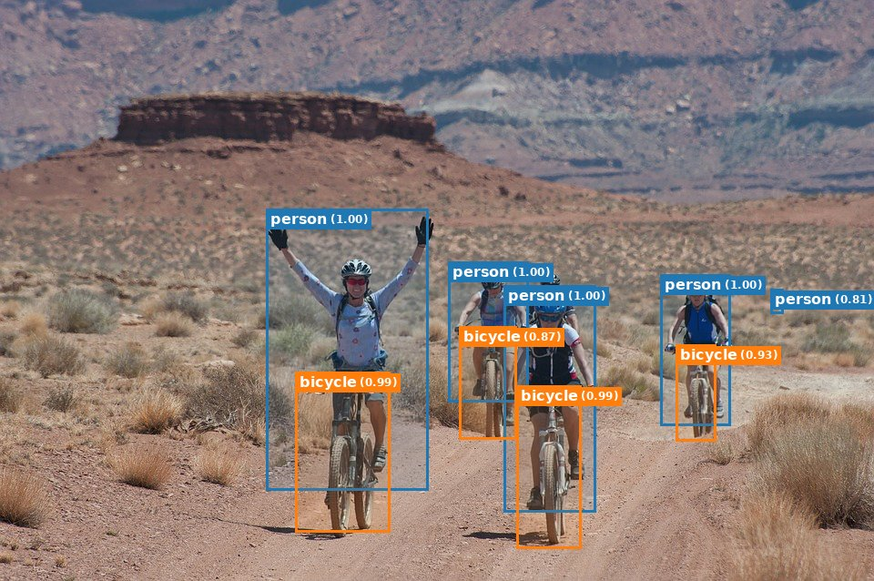
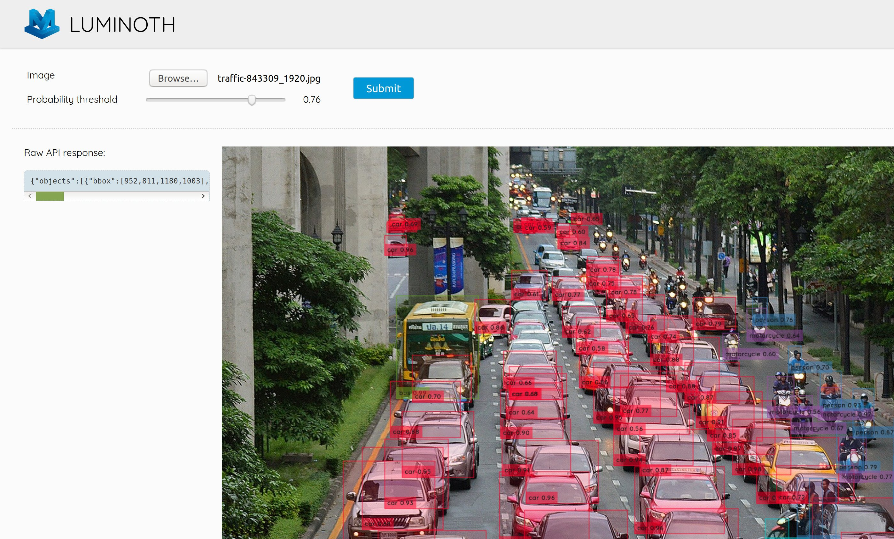

.. _tutorial/01-first-steps:

First steps
===========

In this section, we are going to walk through the baby steps of using Luminoth.

The first thing is being familiarized with the Luminoth CLI tool, that is, the tool that
you interact with using the  ``lumi`` command. This is the main gate to Luminoth, allowing
you to train new models, evaluate them, use them for predictions, manage your checkpoints
and more.

To start, you should fetch a couple of images/videos from the internet. We will try to
play around with traffic-related stuff (cars, pedestrians, bicycles, etc), so we want
images that relate to what you would see on the street. To make it easier, you can use the
following free images:

.. code-block:: text

    https://pixabay.com/en/bicycling-riding-bike-riding-1160860/
    https://pixabay.com/en/traffic-rush-hour-rush-hour-urban-843309/
    https://pixabay.com/en/grandparents-grandmother-people-1969824/
    https://pixabay.com/en/budapest-chain-bridge-jam-pkw-bus-1330977/
    https://videos.pexels.com/videos/people-walking-by-on-a-sidewalk-854100
    https://videos.pexels.com/videos/people-walking-on-sidewalk-992628

But of course, you can Google and try it out with your own images!

Using the shell: detecting objects in an image or video
-------------------------------------------------------

Fire up the shell and go to the directory where your images are located. Let's say we want
Luminoth to predict the objects present in one of these pictures
(``bicycling-1160860_1280.jpg``). The way to do that is by running the following command:

.. code-block:: text

   lumi predict bicycling-1160860_1280.jpg

You will see the following output:

.. code-block:: text

   Found 1 files to predict.
   Neither checkpoint not config specified, assuming `accurate`.
   Checkpoint not found. Check remote repository? [y/N]:

What happens is that you didn't tell Luminoth what an “object” is for you, nor have taught
it how to recognize said objects.

One way to do this is to use a **pre-trained model** that has been trained to detect
popular types of objects. For example, it can be a model trained with `COCO
dataset <http://cocodataset.org/>`_ or `Pascal
VOC <http://host.robots.ox.ac.uk/pascal/VOC/>`_. Moreover, each pre-trained model might be
associated with a different algorithm. This is what **checkpoints** are: they correspond
to the weights of a particular model (Faster R-CNN or SSD), trained with a particular
dataset.

The case of “accurate” is just a label for a particular Deep Learning model underneath, in
this case, Faster R-CNN, trained with images from the COCO dataset. The idea is that
Luminoth assumes that by default you want the most accurate predictions, and it will use
the most accurate model that it knows about. At this time, it is Faster R-CNN, but that
could be replaced in the future and you, as a user, wouldn't have to change your code.

Type ‘y' and Luminoth will check the remote index, to see what checkpoints are available.
Luminoth currently hosts pre-trained checkpoints for Faster R-CNN (COCO) and SSD (Pascal
VOC), though more will be added.

Type ‘y' again after it prompts you to download the checkpoint. The checkpoints will be
stored in ``~/.luminoth`` folder.

After the download finishes, you will get the predictions for your image in JSON format in
the standard output:

.. code-block:: text

   Predicting bicycling-1160860_1280.jpg... done.
   {"file": "bicycling-1160860_1280.jpg", "objects": [{"bbox": [393, 300, 631, 748], "label": "person", "prob": 0.9996}, {"bbox": [978, 403, 1074, 608], "label": "person", "prob": 0.9965}, {"bbox": [670, 382, 775, 596], "label": "person", "prob": 0.9949}, {"bbox": [746, 421, 877, 743], "label": "person", "prob": 0.9947}, {"bbox": [431, 517, 575, 776], "label": "bicycle", "prob": 0.9876}, {"bbox": [775, 561, 860, 792], "label": "bicycle", "prob": 0.9775}, {"bbox": [986, 499, 1057, 636], "label": "bicycle", "prob": 0.9547}, {"bbox": [1135, 420, 1148, 451], "label": "person", "prob": 0.8286}, {"bbox": [683, 480, 756, 621], "label": "bicycle", "prob": 0.7845}, {"bbox": [772, 394, 853, 478], "label": "person", "prob": 0.6044}, {"bbox": [384, 318, 424, 365], "label": "baseball glove", "prob": 0.6037}, {"bbox": [700, 412, 756, 471], "label": "backpack", "prob": 0.5078}, {"bbox": [606, 311, 637, 353], "label": "baseball glove", "prob": 0.5066}]}

This is probably unintelligible to you, and also not apt for machine consumption since
it's mixed with other things in the standard output. However, it's also possible to get
the JSON file with the objects plus the actual image with the overlaid bounding boxes.
With these commands we can output everything to a ``preds`` directory:

.. code-block:: text

   mkdir preds
   lumi predict bicycling-1160860_1280.jpg -f preds/objects.json -d preds/

If you fetch the resulting image, it should look like this:

Not bad!

You can also run predictions on a **video file** in the exact same way. Note that this is
basically independent frame by frame predictions, and has no tracking or interpolation.
Try it out! Depending on the length of the video, it can take a while :)

Exploring pre-trained checkpoints
^^^^^^^^^^^^^^^^^^^^^^^^^^^^^^^^^

Whenever you wish to work with checkpoints, you must first run the ``lumi checkpoint
refresh`` command, so Luminoth knows about the checkpoints that it has available for
download. The remote index can be updated periodically.

After refreshing the local index, you can list the available checkpoints running ``lumi
checkpoint list``:

.. code-block:: text

   ================================================================================
   |           id |                  name |       alias | source |         status |
   ================================================================================
   | e1c2565b51e9 |   Faster R-CNN w/COCO |    accurate | remote |     DOWNLOADED |
   | aad6912e94d9 |      SSD w/Pascal VOC |        fast | remote | NOT_DOWNLOADED |
   ================================================================================

Here, you can see the “accurate” checkpoint that we have used for our predictions before,
and that we also have another “fast” checkpoint that is the SSD model trained with Pascal
VOC dataset. Let's get some information about the “accurate” checkpoint: ``lumi checkpoint info e1c2565b51e9`` or ``lumi checkpoint info accurate``

.. code-block:: text

   Faster R-CNN w/COCO (e1c2565b51e9, accurate)
   Base Faster R-CNN model trained with the full COCO dataset.

   Model used: fasterrcnn
   Dataset information
       Name: COCO
       Number of classes: 80

   Creation date: 2018-04-17T16:58:00.658815
   Luminoth version: v0.1.1

   Source: remote (DOWNLOADED)
   URL: https://github.com/tryolabs/luminoth/releases/download/v0.1.0/e1c2565b51e9.tar

You can see that this dataset consists of 80 classes, and other useful information. Let's
see what the ``fast`` checkpoint is about: ``lumi checkpoint info aad6912e94d9`` or ``lumi checkpoint info fast``

.. code-block:: text

   SSD w/Pascal VOC (aad6912e94d9, fast)
   Base SSD model trained with the full Pascal dataset.

   Model used: ssd
   Dataset information
       Name: Pascal VOC
       Number of classes: 20

   Creation date: 2018-04-12T17:42:01.598779
   Luminoth version: v0.1.1

   Source: remote (NOT_DOWNLOADED)
   URL: https://github.com/tryolabs/luminoth/releases/download/v0.1.0/aad6912e94d9.tar

If you want to get predictions for an image or video using a specific checkpoint (for
example, ``fast``) you can do so by using the ``--checkpoint`` parameter:

.. code-block:: text

   lumi predict bicycling-1160860_1280.jpg --checkpoint fast -f preds/objects.json -d preds/

Inspecting the image, you'll see that it doesn't work as nicely as the ``accurate``
checkpoint.

Also note that in every command where we used the alias of checkpoint, we could also have
used the id.

The built-in interface for playing around
^^^^^^^^^^^^^^^^^^^^^^^^^^^^^^^^^^^^^^^^^

Luminoth also includes a simple web frontend so you can play around with detected objects
in images using different thresholds.

To launch this, simply type ``lumi server web`` and then open your browser at
http://localhost:5000. If you are running on an external VM, you can do ``lumi server web
--host 0.0.0.0 --port <port>`` to open in a custom port.

Now, select an image and submit! See the results.

You can go ahead and change the “probability threshold” slidebar and see how the detection
looks with more or less filtering. You'll see that as you lower the threshold, more
objects appear (and many times these are incorrect), while increasing the threshold makes
the most accurate guesses but misses many of the objects you wish to detect.

----

Next: :ref:`tutorial/02-building-custom-traffic-dataset`
