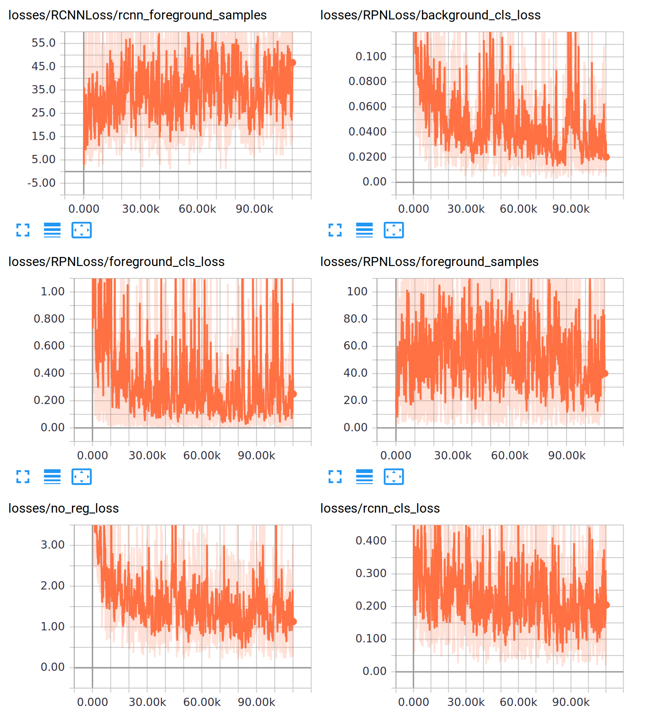
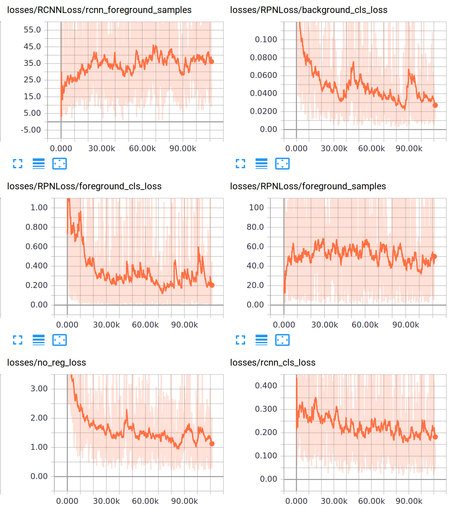

.. _tutorial/04-visualizing-the-training-process:

Using TensorBoard to visualize the training process
===================================================

Now that the training is running, you should pay special attention to how it is
progressing, to make sure that your model is actually learning something.

`TensorBoard <https://www.tensorflow.org/guide/summaries_and_tensorboard>`_ is a very good
tool for this, allowing you to see plenty of plots with the training related metrics. By
default, Luminoth writes TensorBoard summaries during training, so you can leverage this
tool without any effort!

To run it, you can use:

.. code-block:: bash

   tensorboard --logdir <job_dir>/<run_name>

If you are running from an external VM, make sure to use ``--host 0.0.0.0`` and ``--port``
if you need other one than the default 6006.

What to look for
----------------

First, go to the "Scalars" tab. You are going to see several *tags*, but in this case,
you only should care about some of the metrics behind ``losses``.

The loss is your objective function, which you want to minimize. In the case of Faster
R-CNN, we have a model with a multi-objective loss, ie. the model is trying to minimize
several things at the same time. This is why you will see several plots here.

You should mostly be interested in the one called ``no_reg_loss``. This is the total loss
function, without including the regularization loss (which will always decrease).
Therefore, it will give you a nice summary of how the training is progressing.

Your job is to make sure this ``no_reg_loss`` value is going decreasing during training.

As we said before, the loss will jump around a lot, because each point corresponds to a
minibatch, which in this case is a single image. A good prediction in a particular image
will yield a low loss, however, if the model performed poorly another particular image,
the loss will be very high.

To help you notice the trend, you can set **Smoothing** to a higher value. For example,
setting it so 0.95 the plots now look like this:

Now it's much more clear: at first, there is a sharp drop in the loss, but then it is not
as noticeable.

Tips: how to do training and tune hyperparameters
-------------------------------------------------

To get the best result for your dataset, you are going to have to run several training
runs until you nail it. Here is what we have done in the past:

#. Start with a **fixed learning rate**. The "magical" value of 0.0003 has worked for us
   for a variety of problems.
#. Run the training until the loss sort of **stabilizes** for some time (many thousands of
   steps).
#. After the loss is roughly stable, **decrease** the learning rate. For example, you
   might choose a different value like 0.001. In the case of Faster R-CNN model, we
   (approximately) divide the learning rate by 3 (0.0003, 0.0001, 0.00003, ...).
#. You should see the loss leave this plateau and become even smaller. If so, good job!
   Notice the approximate step number in which you would consider that the loss
   stabilized.

This information will let you build a training configuration that is good for your
dataset. For example, you can better tune your configuration for learning rate:

.. code-block:: yaml

   train:
     learning_rate:
       decay_method: piecewise_constant
       boundaries: [steps_1, steps_2, ..., steps_n]
       values: [value_0, value_1, value_2, ..., value_n]

Manually inspecting how model performs with lumi server web
-----------------------------------------------------------

You can also use ``lumi server web`` command that we have seen before and try your
partially trained model in a bunch of novel images.

For this, you can launch it with a config file like:

.. code-block:: bash

   lumi server web -c config.yml

Remember that here you can also use ``--host`` and ``--port`` options should you happen to
need those.

----

Next: :ref:`tutorial/05-evaluating-models`
