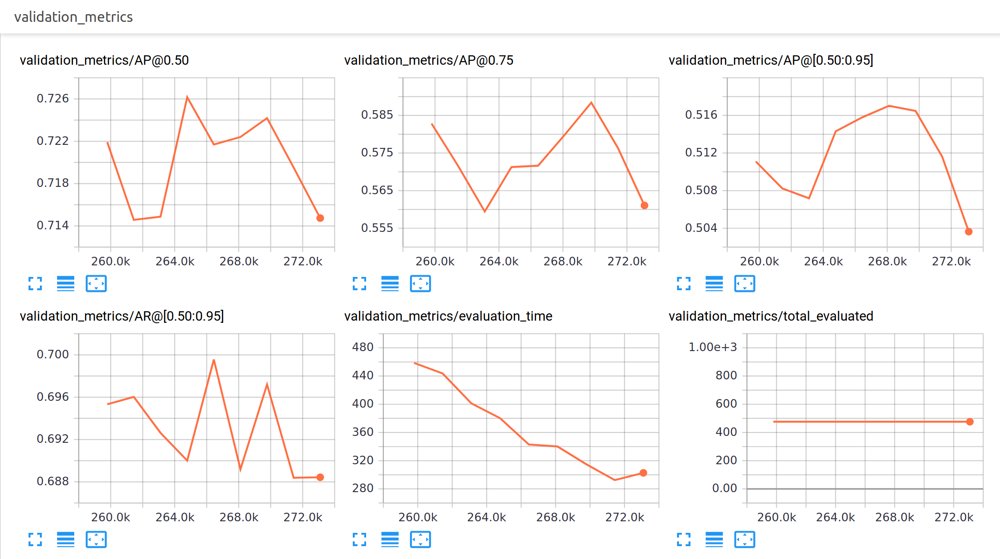
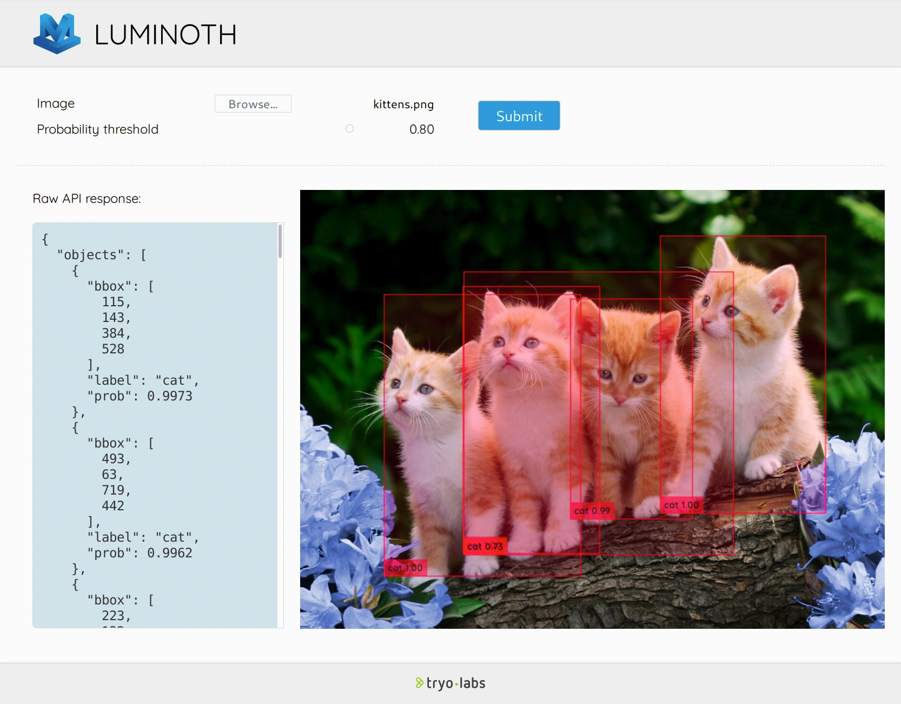

.. _tutorial/05-evaluating-models:

Evaluating models
=================

As you are training the model, your job is to make the training loss decrease.

However, it might be the case that your model is learning to fit your training data very
well, but it won't work as well when it is fed new, unseen data. This is called
*overfitting*, and to avoid it, it is very important to evaluate models in data they
haven't seen during training.

Usually, datasets (like OpenImages, which we just used) provide "splits". The "train"
split is the largest, and the one from which the model actually does the learning. Then,
you have the "validation" (or "val") split, which consists of different images, in which
you can draw metrics of your model's performance, in order to better tune your
hyperparameters. Finally, a "test" split is provided in order to conduct the final
evaluation of how your model would perform in the real world once it is trained.

Building a validation dataset
-----------------------------

Let's start by building TFRecords from the validation split of `OpenImages
<https://storage.googleapis.com/openimages/web/download.html>`_. For this, we can download
the files with the annotations and use the same ``lumi dataset transform`` that we used to
build our training data.

In your dataset folder (where the ``class-descriptions-boxable.csv`` is located), run the
following commands:

.. code-block:: bash

   mkdir validation
   wget -P validation https://storage.googleapis.com/openimages/2018_04/validation/validation-annotations-bbox.csv
   wget -P validation https://storage.googleapis.com/openimages/2018_04/validation/validation-annotations-human-imagelabels-boxable.csv

After the downloads finish, we can build the TFRecords with the following:

.. code-block:: bash

   lumi dataset transform \
         --type openimages \
         --data-dir . \
         --output-dir ./out \
         --split validation  \
         --class-examples 100 \
         --only-classes=/m/015qff,/m/0199g,/m/01bjv,/m/01g317,/m/04_sv,/m/07r04,/m/0h2r6,/m/0k4j

Note that again, we are building a very reduced toy evaluation dataset by using
``--class-examples`` (as we did for training).

The ``lumi eval`` command
-----------------------------

In Luminoth, ``lumi eval`` will make a run through your chosen dataset split (ie.
``validation`` or ``test``), and run the model through every image, and then compute metrics
like loss and mAP.

This command works equivalenty to ``lumi train``, so it will occupy your GPU and output
summaries for TensorBoard.

If you are lucky and happen to have more than one GPU in your machine, it is advisable to
run both ``train`` and ``eval`` at the same time. In this case, you can get things like your
validation metrics in TensorBoard and watch them as you train.

Start by running the evaluation:

.. code-block:: bash

   lumi eval --split validation -c custom.yml

Luminoth should now load the last available checkpoint, and start processing images. After
it's done with a full pass through the split, it will output something like this in the
shell:

.. code-block:: text

    ...
    386 processed in 244.44s (global 1.58 images/s, period 1.87 images/s)
    426 processed in 265.03s (global 1.61 images/s, period 1.94 images/s)
    465 processed in 285.33s (global 1.63 images/s, period 1.92 images/s)
    INFO:tensorflow:Finished evaluation at step 271435.
    INFO:tensorflow:Evaluated 476 images.
    INFO:tensorflow:Average Precision (AP) @ [0.50] = 0.720
    INFO:tensorflow:Average Precision (AP) @ [0.75] = 0.576
    INFO:tensorflow:Average Precision (AP) @ [0.50:0.95] = 0.512
    INFO:tensorflow:Average Recall (AR) @ [0.50:0.95] = 0.688
    INFO:tensorflow:Evaluated in 294.92s
    INFO:tensorflow:All checkpoints evaluated; sleeping for a moment
    INFO:tensorflow:Found 0 checkpoints in run_dir with global_step > 271435

After the full pass, ``eval`` will sleep until a new checkpoint is stored in the same
directory.

The mAP metrics
^^^^^^^^^^^^^^^

Mean Average Precision (mAP) is the metric commonly used to evaluate object detection
task. It computes how well your classifier works **across all classes**.

We are not going to go over how it works, but you can read `this blog
post <https://medium.com/@jonathan_hui/map-mean-average-precision-for-object-detection-45c121a31173>`_
for a nice explanation.

What you need to know is that mAP will be a number between 0 and 1, and the higher the
better. Moreover, it can be calculated across different IoU (Intersection over Union)
thresholds.

For example, Pascal VOC challenge metric uses 0.5 as threshold (notation mAP@0.5), and
COCO dataset uses mAP at different thresholds and averages them all out (notation
mAP@[0.5:0.95]). Luminoth will print out several of these metrics, specifying the
thresholds that were used under this notation.

Visualizing evaluation metrics in TensorBoard
---------------------------------------------

If you fire up TensorBoard, you will see that you get new "tags" that come from the
evaluation: in this case, we will get ``validation_metrics`` and ``validation_losses``.

``validation_losses``
^^^^^^^^^^^^^^^^^^^^^^^^^

Here, you will get the same loss values that Luminoth computes for the train, but for the
chosen dataset split (validation, in this case).

As in the case of train, you should mostly look at ``validation_losses/no_reg_loss``. As
long as it goes down, you know the model is learning.

If the training loss keeps decreasing but validation loss does not, you know that your
model is no longer learning anything useful and can thus stop the training. If your
validation loss starts to increase, then you know your model is overfitting.

``validation_metrics``
^^^^^^^^^^^^^^^^^^^^^^^^^^

These will be the mAP metrics that will help you judge how well your model perform.

For viewing these plots, some important considerations:

* Unlike with the other metrics, you do not want to use Smoothing here. The mAP values
  refer to the entire dataset split, so it will not jump around as much as other metrics.
* Click "Fit domain to data" (third blue button in the bottom left of each plot) in order
  to see the full plot.

Visual inspection of the model
------------------------------

As another reminder, do not forget that it is crucially important that you verify that the
model is working properly by doing manual inspection of the results. You will find ``lumi
server web`` very useful for this.

mAP numbers are good as a summary, but inspecting the model's behavior will let you
discover specific cases that are not working and could be improved by tuning some other
hyperparameter. For example, you might add more anchor scales if the sizes of your objects
varies a lot.

----

Next: :ref:`tutorial/06-creating-own-checkpoints`
